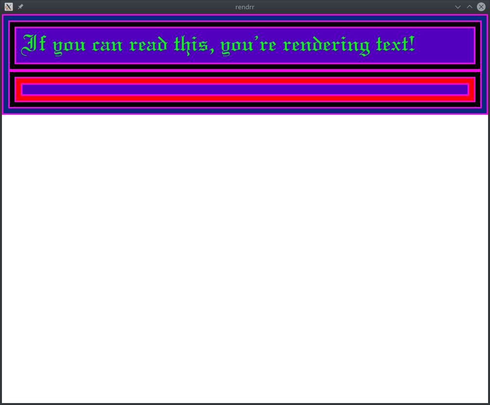

# rendrr

rendrr is a toy rendering engine that can parse and render HTML, CSS, and text to a window in your OS. The project is intended to be used as a tool for hands-on exploration of how browsers work; it exists as a sandbox in which to add, change, remove features over time and to dive into the concepts and technologies that make up a browser.

The code for rendrr is largely based on https://github.com/mbrubeck/robinson and the accompanying tutorial, though many parts are written from scratch and/or extend past the robinson code. Any use of code from robinson was done as a temporary solution to allow for focus on building out other features.

Current working features of rendrr include:
- parse HTML and CSS
- basic implementation of CSS box model (block/inline, border, padding, margin)
- render text and color (borders, font colors, background colors)
- render to OS window (using SDL2)

## How to run

1. If you do not have Rust installed on your machine follow these instructions for installation: https://rustup.rs/. Otherwise, skip to step 2.
2. Clone or fork this repo onto your local machine.
3. Run the program using Cargo, the package manager and build system for Rust that comes packaged with rustup. Enter this command into your terminal:

    `cargo run -- --html example/index.html --css example/index.css`
4. This command should produce the following screenshot:
   

## Important notes

You can feed any HTML and CSS file to the `--html` and `--css` arguments; simply replace the file names in the `cargo run` command with the new names. Keep in mind the limited functionality of this app outlined in the list of working features. Also note that the files you pass here must exist on your local machine, and you can only provide one of each type of file.

The command line flags are implemented using the `getopts` crate (https://github.com/rust-lang-nursery/getopts). The code to implement these flags is in the `src/main.rs` file.

The rendering / painting is implemented using the `sdl2` crate (https://github.com/Rust-SDL2/rust-sdl2), which provides Rust bindings for the SDL2 library.

## Next steps / potential new features
- Implement `link` tags for CSS stylesheets
- Create URL bar in browser window for retrieving HTML webpage (removes need for --html flag)
- Replace SDL2 with OpenGL
- Enable font definitions in stylesheets (lookup defined font-family within browser code)
- Implement networking; retrieve files from remote server
